# 🏦 Banking Analytics Platform — Azure Databricks Lakehouse

An end-to-end **medallion architecture (Bronze → Silver → Gold)** data platform built on **Azure Databricks, ADLS Gen2, Unity Catalog, and Azure Synapse Analytics**, processing 10 interconnected banking datasets into governed, business-ready analytics tables.

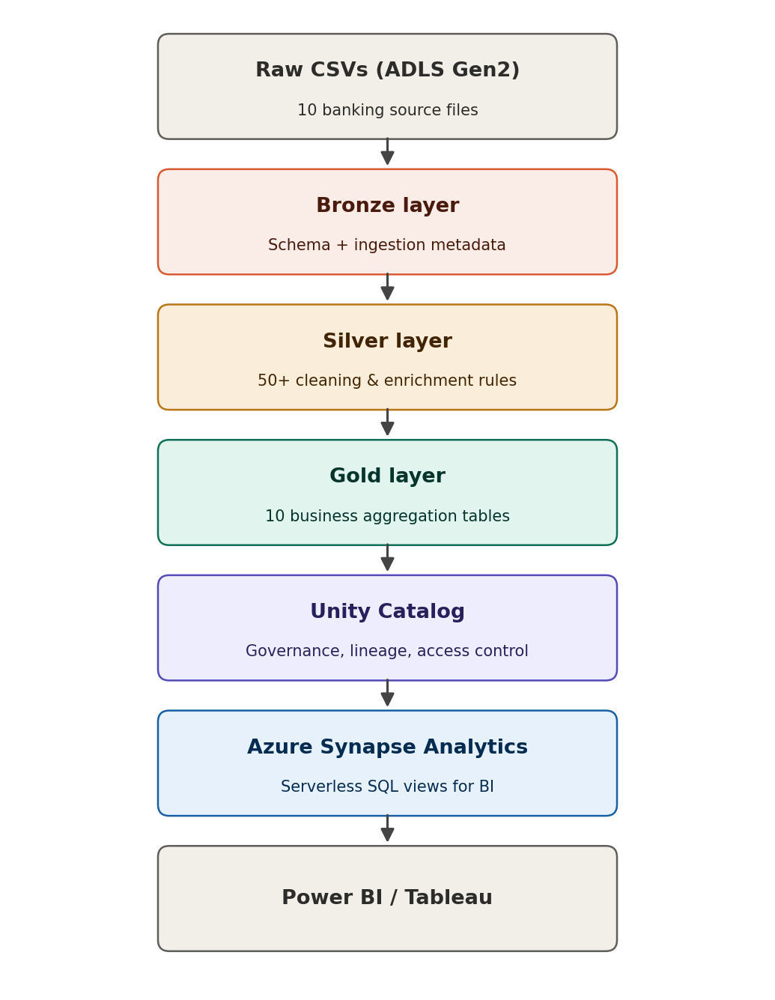

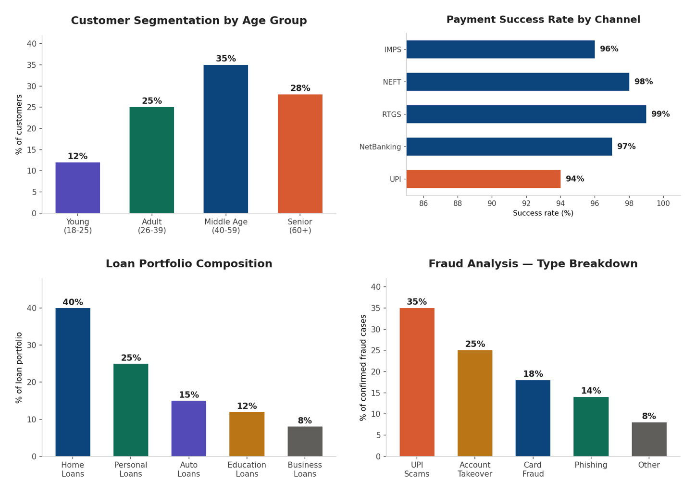

---

## 📌 Overview

This project simulates a real-world retail banking data platform — ingesting raw operational data (customers, accounts, transactions, loans, cards, fraud, support tickets, etc.) and transforming it through a governed lakehouse pipeline into curated, dashboard-ready datasets for cross-selling, risk, fraud, and performance analytics.

| | |
|---|---|
| **Cloud Platform** | Microsoft Azure |
| **Compute / ETL** | Azure Databricks (PySpark, Delta Lake) |
| **Governance** | Unity Catalog |
| **Analytics Layer** | Azure Synapse Analytics (Serverless SQL) |
| **Storage** | Azure Data Lake Storage Gen2 (5 containers) |
| **Architecture Pattern** | Medallion (Raw → Bronze → Silver → Gold) |

---

## 🗂️ Datasets

10 CSV source files, ~17,150 total records:

| Dataset | Rows |
|---|---|
| customers.csv | 1,000 |
| accounts.csv | 1,400 |
| transactions.csv | 10,000 |
| loans.csv | 800 |
| credit_cards.csv | 900 |
| branches.csv | 50 |
| employees.csv | 500 |
| fraud_transactions.csv | 600 |
| insurance_products.csv | 700 |
| customer_support_tickets.csv | 1,200 |

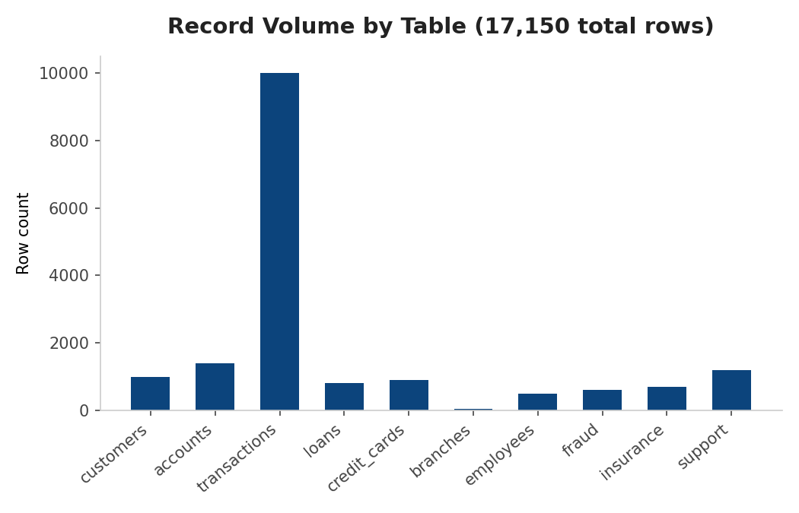

---

## 🏗️ Architecture

```
Raw CSVs (ADLS Gen2 - raw/)
        │
        ▼
  Bronze Layer  →  Schema enforcement, ingestion metadata, no cleaning (10 tables)
        │
        ▼
  Silver Layer  →  50+ cleaning / standardization / enrichment rules (10 tables)
        │
        ▼
  Gold Layer    →  10 business aggregation tables for BI dashboards
        │
        ▼
  Unity Catalog →  Governance, lineage, access control
        │
        ▼
  Azure Synapse →  Serverless SQL views for BI tools
```

**Storage containers:** `raw` · `bronze` · `silver` · `gold` · `archive`
**Unity Catalog:** 1 catalog · 3 schemas · 20 registered tables

---

## ⚙️ Pipeline Phases

| Phase | Description | Output |
|---|---|---|
| 1 | Azure infrastructure setup (Resource Group, ADLS Gen2, Databricks, Synapse) | 5 containers, 2 workspaces |
| 2 | Upload 10 datasets to raw container | 10 source files |
| 3 | Unity Catalog setup (access connector, RBAC, storage credentials, external locations, catalog/schemas) | Governed catalog |
| 4 | Read all datasets with inferred schema | Data validation |
| 5 | Read datasets with explicit schemas | Type-safe DataFrames |
| 6 | Bronze layer — raw data as Delta tables + ingestion metadata | 10 Bronze tables |
| 7 | Silver layer — cleaning, standardization, enrichment (50+ rules) | 10 Silver tables |
| 8 | Gold layer — business aggregations & KPIs | 10 Gold tables |
| 9 | Unity Catalog registration | Centralized lineage |
| 10 | Synapse integration (linked service, Spark pool, serverless SQL views) | Unified analytics layer |

---

## 🔧 Key Transformations (Silver Layer)

- **Customers** — age/age-group, full name, income bracket, email domain, tenure, KYC verification flag
- **Accounts** — status standardization, active flag, balance category, account age
- **Transactions** — date-part extraction, amount categorization, debit/credit/success/failed flags, payment mode standardization
- **Loans** — status standardization, interest & total payable calculation, loan amount category, collateral flag
- **Credit Cards** — utilization %, utilization category, expiry tracking, card type standardization
- **Fraud** — risk level, confirmed/false-positive/open-investigation flags, loss category, detection delay
- **Support Tickets** — priority scoring, resolution time & category, channel/issue standardization

**75+ derived columns** created across all tables.

---

## 📊 Gold Layer — Business Dashboards

| Gold Table | Purpose | Business Value |
|---|---|---|
| `customer_360` | Full customer profile (accounts, loans, cards, assets, risk score) | Cross-sell, risk assessment, segmentation |
| `branch_performance` | Deposits, loans, employee efficiency, net flow | Resource allocation, benchmarking |
| `loan_portfolio` | Loan count, amount, interest income | Risk monitoring, profitability |
| `fraud_analysis` | Fraud count, loss, confirmation rate | Fraud prevention |
| `daily_transaction_trends` | Transaction volume/value/success rate | Capacity planning |
| `customer_support_metrics` | Ticket volume, resolution rate/time | SLA monitoring |
| `monthly_financial_summary` | Credits, debits, net flow, UPI volume | Financial planning |
| `employee_performance` | Headcount, salary, active employees | HR/workforce planning |
| `cross_sell_insights` | Loan/card/insurance penetration | Marketing campaigns |
| `balance_distribution` | Account/balance distribution | Liquidity management |

---

## 💡 Business Insights

| Category | Finding | Recommendation |
|---|---|---|
| Customer Segmentation | 35% Middle Age (40-59), 28% Senior (60+) | Target retirement products to seniors |
| Income Distribution | 42% Medium income, 28% High income | Offer premium cards to High segment |
| Account Types | 60% Savings, 25% Current, 10% FD | Promote FDs for idle savings |
| Transaction Patterns | UPI = 45% of volume, 25% of value | Invest in UPI infrastructure |
| Payment Success | UPI 94%, NetBanking 97%, RTGS 99% | Improve UPI reliability |
| Loan Portfolio | Home loans 40%, Personal loans 25% | Cross-sell insurance with home loans |
| Fraud | UPI scams 35%, Account takeover 25% | Stronger UPI security, MFA |
| Support Tickets | Card block 28%, Failed txn 22%, KYC 15% | Self-service card block, proactive KYC |
| Cross-sell | 60% customers hold only a savings account | Targeted loan/card/insurance campaigns |
| Branch Performance | Top 5 branches = 40% of deposits | Replicate best practices |

### Customer & income segmentation

<p align="center">
  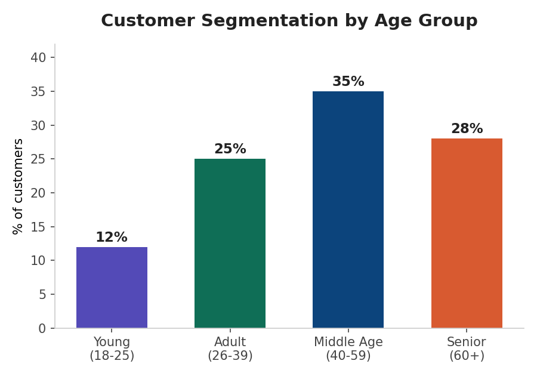
  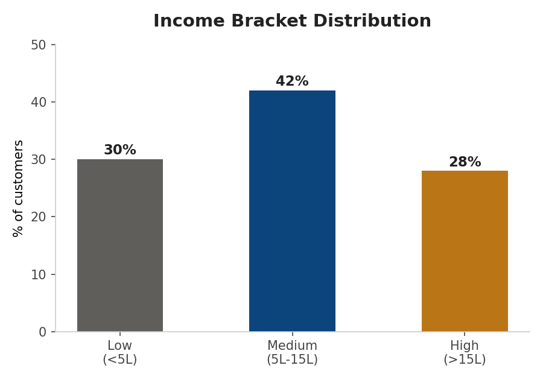
</p>

### Account type mix

<p align="center">
  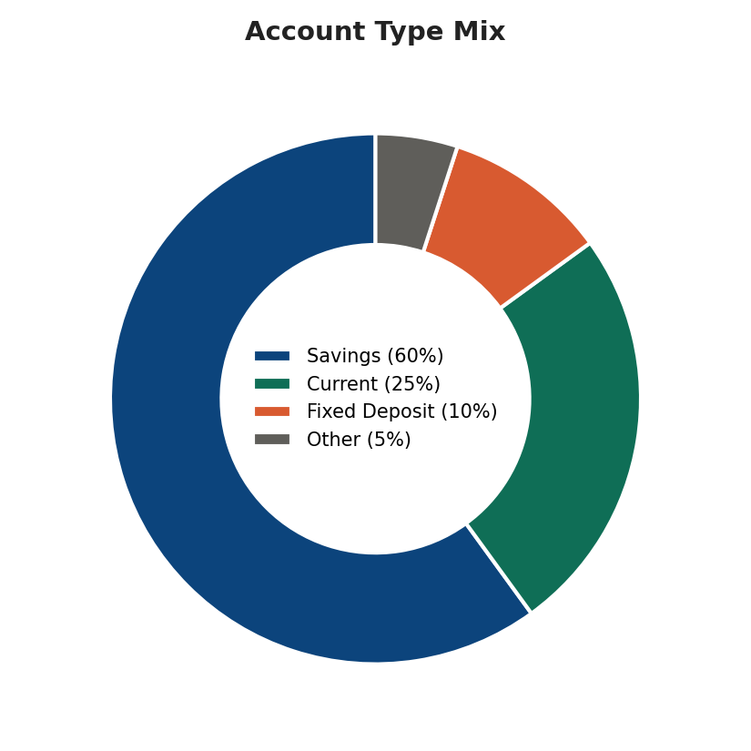
</p>

### Payment channel reliability

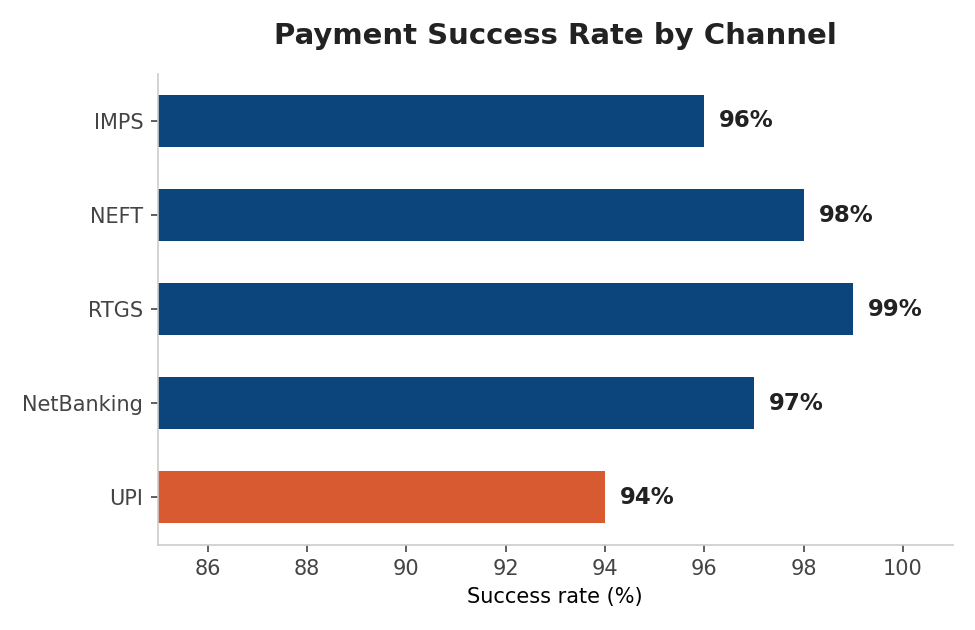

### Loan portfolio & fraud patterns

<p align="center">
  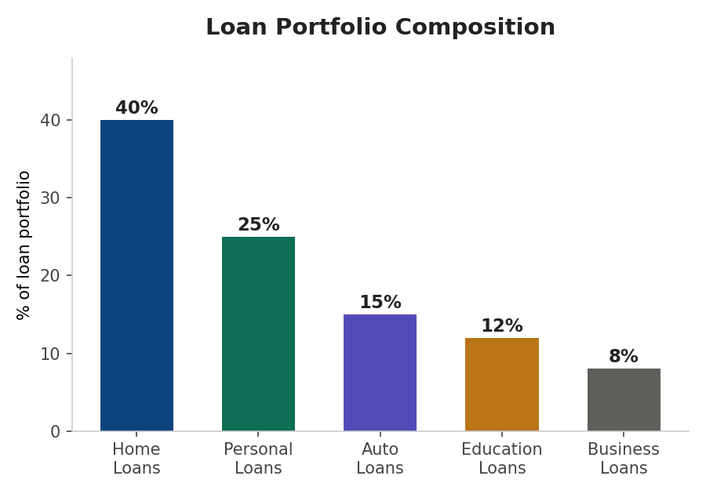
  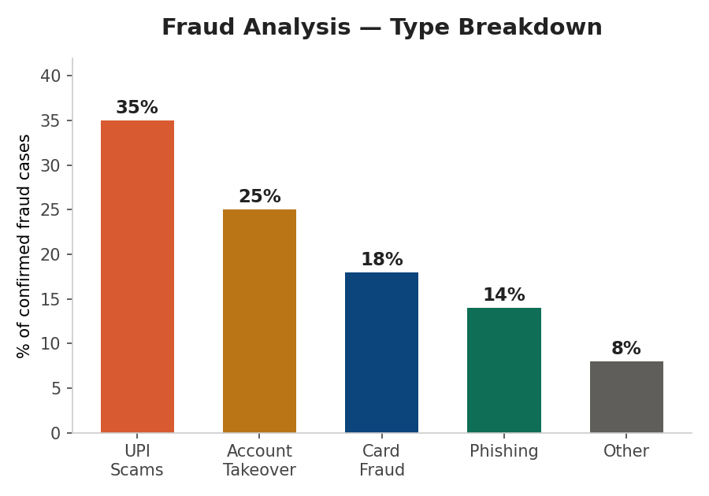
</p>

### Support tickets & cross-sell opportunity

<p align="center">
  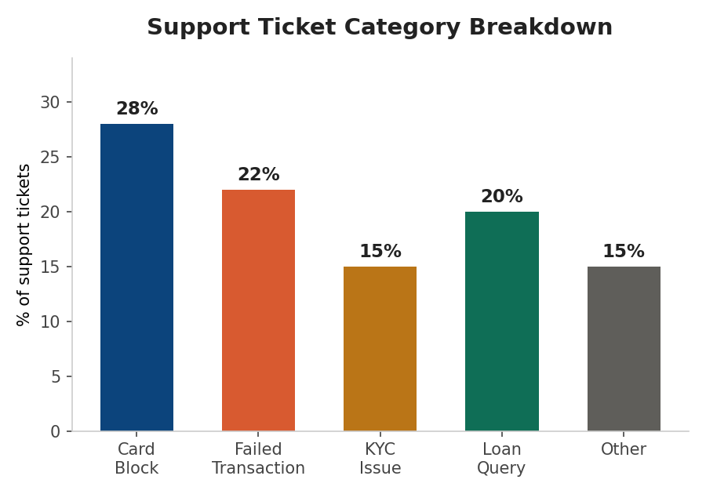
  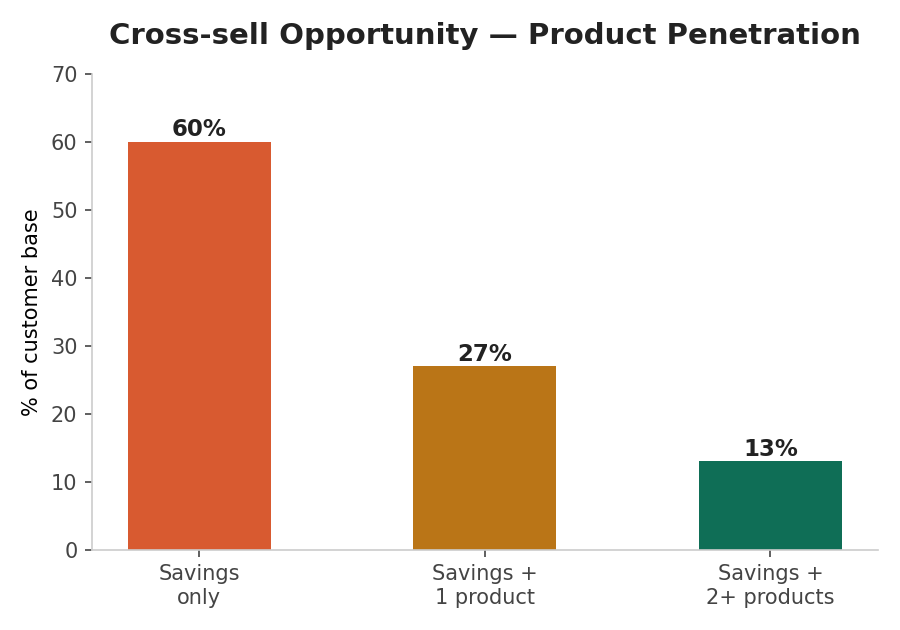
</p>

### Branch performance

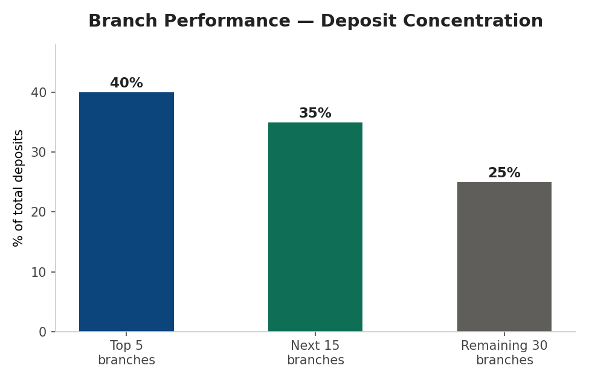

---

## 📈 Results

- **17,150** raw records processed end-to-end
- **30 tables** created (10 Bronze + 10 Silver + 10 Gold)
- **50+** transformation rules, **75+** derived columns
- **10-100x** query performance improvement (CSV → partitioned Delta)
- **10** business-ready dashboards

---

## 💰 Estimated Monthly Cost (Azure, dev-scale)

| Service | Tier | Est. Cost |
|---|---|---|
| ADLS Gen2 (10 GB) | Standard, LRS | ~$0.20 |
| Databricks Workspace | Premium | ~$0.50 |
| Databricks Cluster | 2–8 nodes, DS3_v2 | ~$150–300 |
| Synapse Workspace | Basic | ~$0.50 |
| Synapse Spark Pool | Small, 3–10 nodes | ~$50–100 |
| **Total** | | **~$200–450/month** |

---

## 🚀 Getting Started

> This repo documents the pipeline design and notebooks used to build the platform. See [`CASE_STUDY.md`](CASE_STUDY.md) for the full technical write-up and design rationale.

1. Provision Azure resources (Resource Group, ADLS Gen2, Databricks, Synapse) — Phase 1 steps in [`CASE_STUDY.md`](CASE_STUDY.md)
2. Upload the 10 source CSVs to the `raw` container
3. Run notebooks in order:
   - `01_read_all_datasets` — read & validate raw data with inferred schema
   - `02_read_with_schemas` — re-read with explicit, type-safe schemas
   - `03_create_bronze_delta_tables` — write Bronze Delta tables + ingestion metadata
   - `04_silver_transformations` — apply 50+ cleaning/enrichment rules
   - `05_gold_transformations` — build the 10 Gold aggregation tables
   - `06_register_tables_unity_catalog` — register all tables in Unity Catalog
   - `SettiungUPExternalLocation` — Setting up External Location
4. Query Gold tables via Synapse Serverless SQL or connect a BI tool (Power BI, Tableau)

---

## 🛠️ Tech Stack

`Azure Databricks` · `PySpark` · `Delta Lake` · `Azure Data Lake Storage Gen2` · `Unity Catalog` · `Azure Synapse Analytics` · `Parquet` · `Azure Data Factory` · `Power BI`

---

## 📄 License

This project is for portfolio/educational purposes.
